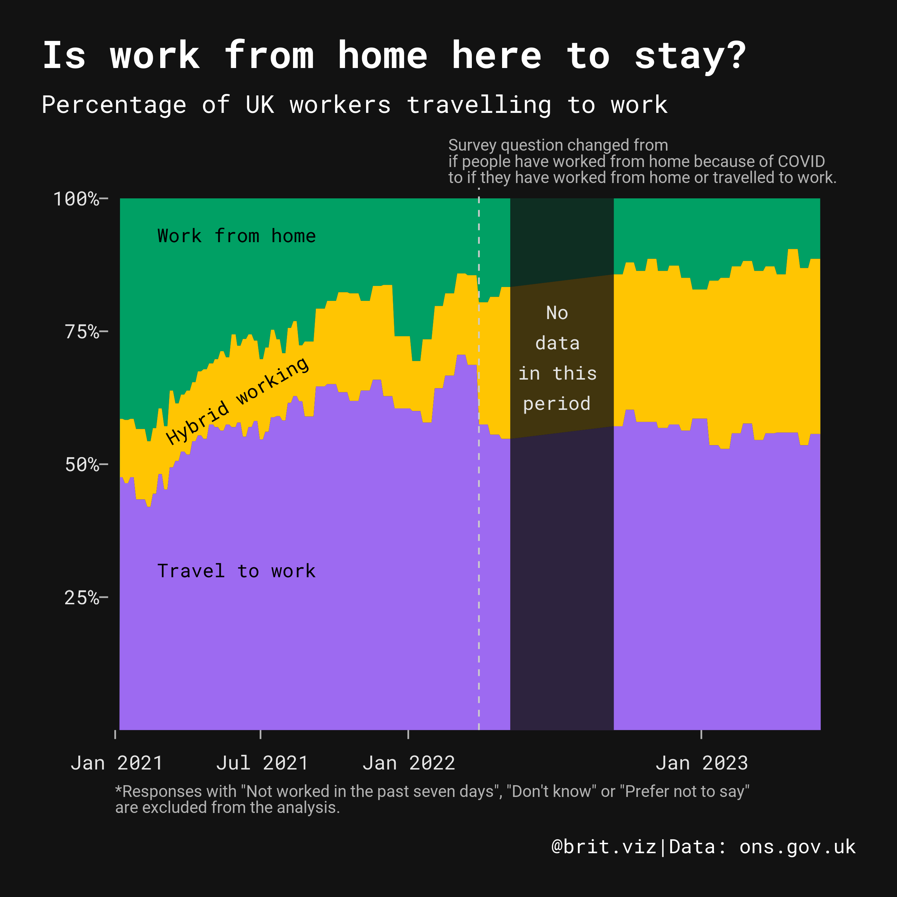
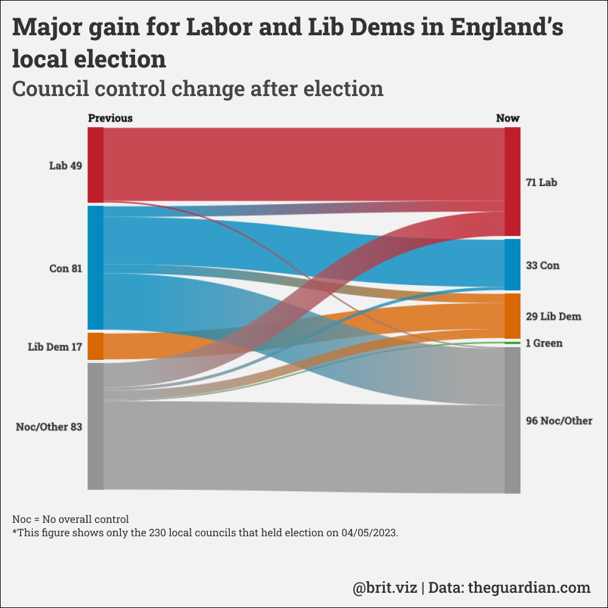

# Data Visualisation
A collection of data visualisations I made with different tools, including Excel, ggplot2, RawGraph and Flourish. 

## UK's work from home trend

## 2023 England local election

## UK's 4-day work week pilot

## Top baby names in the UK

## Tidy Tuesday 2023 Week 17: London Marathon
